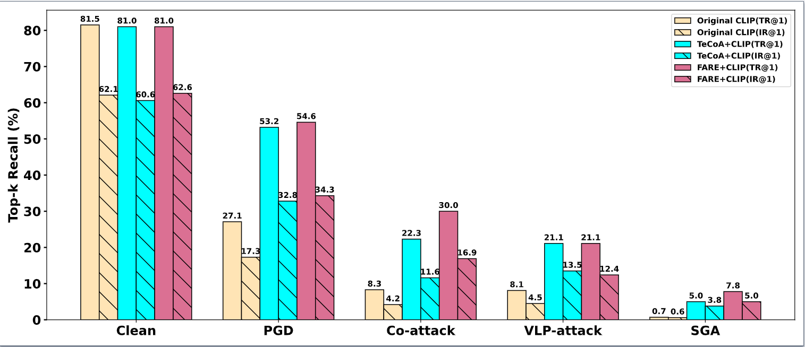
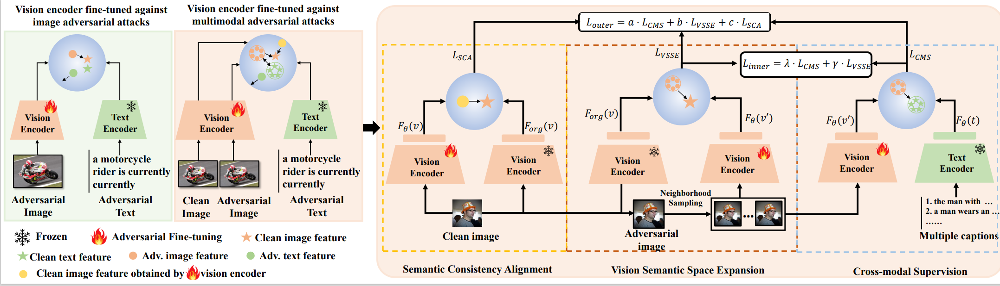

## MAVA

This repository contains code for the paper "Boosting Adversarial Robustness of Vision-Language Pre-training Models against Multimodal Adversarial attacks"


***

Our approach refines vision encoders using Multi-granularity Aligned Visual Adversarial Fine-tuning, which enhances robustness by expanding the vision semantic space and aligning features across perturbed and clean models.

### Installation
***
The code is tested with Python 3.9. To install the required packages, run:
```
pip install -r requirements.txt
```
### Training
***
For the image-text retrieval task (Taking the CLIP model as an example, the same applies to other models):
cd ./adversarial_robustness/CLIP
```
CUDA_VISIBLE_DEVICES="0,1,2" nohup python -m torch.distributed.launch --nproc_per_node 3 adversarial_training_image_encoder.py
```
For the visual entailment task (Taking the ALBEF model as an example, the same applies to other models):

cd ./adversarial_robustness_VE/
```
CUDA_VISIBLE_DEVICES="0,1,2" nohup python -m torch.distributed.launch --nproc_per_node 3 adversarial_training_image_encoder_VE_ALBEF.py
```

### Evaluation
***
1. Multimodal Adversarial Attacks:

a. [Co-attack](https://github.com/adversarial-for-goodness/Co-Attack/blob/main/)
b. [SGA](https://github.com/Zoky-2020/SGA)
c. [VLP-attack](https://github.com/wangyouze/VLP-attack)

2. AutoAttack:

cd ./adversarial_robustness_VE/
```
python VE_autoattack.py --eps 2.0 --fine_tuning True
```


Citation
***
```
@inproceedings{wang2025boosting,
  title={Boosting Adversarial Robustness of Vision-Language Pre-training Models against Multimodal Adversarial attacks},
  author={Wang, Youze and Hu, Wenbo and Li, Qin and Hong, Richang},
  booktitle={ICLR 2025 Workshop on Building Trust in Language Models and Applications}
}```